<a name="readme-top"></a>

<!-- PROJECT LOGO -->
<br />

<div align="center">
  <a href="https://github.com/mathieuhd/gr-opssat">
    
  </a>

<h3 align="center">gr-opssat</h3>

  <p align="center">
    Receive and read telemetry<br />from the ESA OPS-SAT Space Lab!
    <br />
    <br />
    <a href="https://opssat1.esoc.esa.int/">Community platform</a>
    ·
    <a href="https://opssat1.esoc.esa.int/projects/amateur-radio-information-bulletin">Amateur Radio Information Bulletin</a>
    ·
    <a href="https://www.esa.int/Our_Activities/Operations/OPS-SAT">OPS-SAT on esa.int</a>
    ·
    <a href="https://www.n2yo.com/satellite/?s=44878">Track on N2YO</a>
  </p>

</div>

<!-- TABLE OF CONTENTS -->
<details>
  <summary>Table of Contents</summary>
  <ol>
    <li><a href="#about-the-project">About The Project</a></li>
    <li><a href="#overview">Overview</a></li>
    <li>
      <a href="#getting-started">Getting Started</a>
      <ul>
        <li><a href="#minimal-installation">Minimal installation</a></li>
        <li><a href="#complete-installation">Complete installation</a></li>
      </ul>
    </li>
    <li>
        <a href="#usage">Usage</a>
        <ul>
            <li><a href="#setup-tweak-and-debug">Setup, tweak, and debug</a></li>
            <li><a href="#run-the-station">Run the station</a></li>
            <li><a href="#engage-gpredict-radio-control">Engage Gpredict radio control</a></li>
        </ul>
    </li>
    <li>
        <a href="#changes-to-original-repository">Changes to original repository</a>
        <ul>
            <li><a href="#diagrams">Diagrams</a></li>
            <li><a href="#documentation">Documentation</a></li>
        </ul>
    </li>
    <li><a href="#license">License</a></li>
  </ol>
</details>


<!-- ABOUT THE PROJECT -->

## About The Project

This repository contains documentation, and applications for receiving, demodulating, and decoding the UHF signal transmitted by the ESA OPS-SAT mission. It also contains a full graphical application for viewing and parsing the beacon frames transmitted by OPS-SAT.


This repository is an updated version of https://github.com/esa/gr-opssat in order to keep compatibility with GNURadio 3.10+.

_Initial authors:_ Fischer Benjamin (benjamin.fischer@arcticspacetech.com), Tom Mladenov (tom.mladenov@esa.int)

_Upgrades:_ Mathieu Havard (mathieu.havard@esa.int)

<p align="right">(<a href="#readme-top">back to top</a>)</p>


## Overview

THe project receives and process signal emitted by the OPS-SAT Space Laboratory as depicted below.

```mermaid
flowchart LR
  opssat(("OPS-SAT<br/>🛰️"))
  rtl_hw["RTL Antenna<br/>📡"]
  gpredict>"Gpredict<br/>🔭"]
  uhf_rx(["UHF receiver"])
  demod_decode(["Demodulator & decoder"])
  tm_view(["OPS-SAT UHF Desktop<br/>🖥️"])
  
  opssat -.->|"RF (UHF)<br/>437.2MHz"| rtl_hw
  rtl_hw -->|Soapy RTLSDR<br/>module| uhf_rx 
  gpredict -->|Radio control<br/>localhost:4532| uhf_rx
  subgraph gr-opssat
    uhf_rx -->| ZMQ<br/>localhost:5555 | demod_decode 
    demod_decode -->|ZMQ<br/>localhost:38211| tm_view
  end
```


You will find in this repository the last 3 computational nodes of the chain:

| UHF receiver | OPS-SAT Demodulator & decoder | OPS-SAT UHF Desktop |
| ------------ | ----------------------------- | ------------------- |
| apps/os_uhf_rx.grc | apps/os_demod_decode.grc | apps/desktop/main.py |
| 1. Offset sampling<br/>2. Doppler compensation (with GPredict)<br/>3. Frequency shifting to baseband and downsampling<br/>4. Noise suppressor (Squelch)<br/>5. ZMQ sink | 1. ZMQ source<br/>2. GMSK demodulator<br/>3. Decoder<br/>5. Output: Payload frame | 1. Written in Python 3<br/>2. Uses a ZMQ subscriber to get data from GR flowgraph (apps/os-demod-decode.py)<br/>3. Parses, and views beacon content fields in engineering values |
| Depends on:<br />- Gpredict<br/>- https://github.com/ghostop14/gr-gpredict-doppler | Depends on:<br />- https://github.com/daniestevez/gr-satellites | Depends on:<br />- Python3<br/>- https://pypi.org/project/PyQt5/<br/>- https://pypi.org/project/pyzmq/<br/>- https://pypi.org/project/crccheck/<br/>- https://pypi.org/project/numpy/ |

You will also find additional resources to help you:

1. The OPS-SAT UHF specification, found in `docs/os-uhf-specs.pdf`;
2. Two beacon signal recordings to help you tune your setup, found in `recordings`:
   1. A strong beacon, sampled at 200kbps
   2. A realistic beacon, sampled at 250kbps

<p align="right">(<a href="#readme-top">back to top</a>)</p>

<!-- GETTING STARTED -->

## Getting Started

To get the OPS-SAT UHF Desktop application up and running, follow the insctructions below.

1. To begin, get a local copy of the repository:
   ```sh
   git clone https://github.com/mathieuhd/gr-opssat.git
   ```
2. **Optionnal** If you plan on testing your setup with beacon recordings before connecting to a real antenna (what you will most likely be doing), extract the provided archives:
   ```sh
   cd gr-opssat/recordings
   7za x osat_437.16M_250k_beacon_realistic_mode6.cf32.7z # Realistic beacon
   7za x osat_437.16M_200k_beacon_mode6.cf32.7z # Strong beacon (for clear signal)
   ```
3. Proceed with the `minimal installation` detailed below;
4. **Optionnal** After completing step 3 - if you plan on editing the radio modules (what you will most likely be doing), proceed with the `complete installation` detailed below.

### Minimal installation

The minimal installation allows you to run directly the pre-generated Python code. It can work at the condition that your setup is fully compatible with the configuration in the repository.

<details>
  <summary>Minimal installation</summary>

  ```sh
  # Python and dependencies
  sudo apt install python3
  pip install PyQt5
  pip install pyzmq
  pip install crccheck
  pip install numpy

  # SoapySDR and its RTL-SDR module
  sudo apt install soapysdr
  sudo apt install soapysdr-module-rtlsdr

  # Gpredict
  sudo apt install gpredict
  ```

  Two-liner equivalent code:
  ```sh
  sudo apt install python3 soapysdr soapysdr-module-rtlsdr gpredict
  pip install PyQt5 pyzmq crccheck numpy
  ```
</details>

<details>
  <summary>Minimal installation (using conda)</summary>

  ```sh
  # Activate your conda environment
  conda activate <environment_name>

  # Python and dependencies
  sudo apt install python3 # if you have conda, you already have Python
  pip install PyQt5
  pip install pyzmq
  pip install crccheck
  pip install numpy

  # SoapySDR and its RTL-SDR module
  conda install -c conda-forge soapysdr
  conda install -c conda-forge soapysdr-module-rtlsdr

  # Gpredict
  sudo apt install gpredict
  ```

  Four-liner equivalent code:
  ```sh
  conda activate <environment_name>
  sudo apt install python3 gpredict
  pip install PyQt5 pyzmq crccheck numpy
  conda install -c conda-forge soapysdr soapysdr-module-rtlsdr
  ```
</details>

Once Gpredict is installed, you will have to configure it before being able to use it.

<details>
  <summary>Set up ground station</summary>

In the module's burger menu on the top right, click "Configure". In the "Ground station" drop-down list, select your location - you might need to add it to the list before by clicking the "Add" button next to it.

  In the bottom part of the screen, search for OPS-SAT in the satellites catalog and add it to the list on the right.

  

</details>

<details>
  <summary>Create interface to application</summary>

  To allow Gpredict feeding doppler correction to the python application, you mut create a software interface between them.

  In the menu "Edit > Preferences", go to the "Interfaces > Radios" tab. Create a new radio as shown below:

| Setting    | Value                              |
| ---------- | ---------------------------------- |
| Name       | GR-RX (or any other name you want) |
| Host       | localhost                          |
| Port       | 4532                               |
| Radio type | RX only                            |

  

</details>


### Complete installation

The python modules are generated with GNURadio, thanks to specific extensions providing the required blocks to receive, demodulate, and decode the RF signal emitted by the spacecraft. **In addition to the minimal installation**, be sure to install the following:

<details>
  <summary>Complete installation (using conda)</summary>

  ```sh
  # Activate your conda environment
  conda activate <environment_name>
  
  # GNURadio
  conda install -c conda-forge gnuradio
  # on my actual setup I had to install via 'sudo apt install gnuradio'
  
  # GNURadio-satellites
  conda install -c conda-forge gnuradio-satellites
  
  # gr-gpredict-doppler
  # see [gr-gpredict-doppler](https://github.com/ghostop14/gr-gpredict-doppler) for more details
  sudo apt install cmake
  sudo apt install libgmp-dev
  sudo add-apt-repository ppa:mhier/libboost-latest
  sudo apt update
  sudo apt install libboost1.83-all-dev
  cd /tmp
  git clone https://github.com/ghostop14/gr-gpredict-doppler.git
  cd gr-gpredict-doppler/
  mkdir build
  cd build
  cmake ../
  make
  sudo make install
  ```

</details>

<p align="right">(<a href="#readme-top">back to top</a>)</p>


<!-- USAGE EXAMPLES -->
## Usage

### Setup, tweak, and debug

Using the complete installation allows you to control and tweak the radio modules to fit your setup. Open the diagrams with GNURadio Companion to edit them, generate the Python code, and debug them.

```sh
cd gr-oppsat/apps/
gnuradio-companion os_uhf_rx.grc os_demod_decode.grc &
```

For setup and debug, you might want to use the provided beacon recordings:
- [ ] Disable the SoapySDR source
- [ ] Enable the file source and the throttle
- [ ] In the file source block, be sure to point to the extracted .cf32 file on your system
- [ ] Set the sampling rate (variable 'samp_rate') accordingly:
  - 200k for the strong beacon recording;
  - 250k for the realistic beacon recording.

To test your setup, start the 2 radio modules from GNURadio and run the TM viewer in parallel:
```sh
python3 desktop/main.py &
```


To test your setup end-to-end (inc. your SDR reciever), you need to run also Gpredict and engage the radio control. Refer to section below for further details. If you were using the recordings, be sure to revert the changes in order to switch to the correct signal source:

- [ ] Enable  the Soapy RTL-SDR source
- [ ] **Make sure the ppm offset of your SDR (in the Soapy RTL-SDR source block) and the UTC time (for Gpredict) are set correctly.**
- [ ] Disable the file source and the throttle
- [ ] Set the sampling rate (variable 'samp_rate') to 250k. With higher samplerates or other SDRs it might be necessary to decrease the lowpass filter taps (increase the transition width) to avoid flowgraph congestion.

```sh
gpredict &
```

_Note: when using the beacon recordings, you **should not** run Gpredict._

<p align="right">(<a href="#readme-top">back to top</a>)</p>

### Run the station

Providing the generated python files are compatible with your setup (either the ones in this repository are compatible out-of-the-box or you previously adapted them to your setup), you can run all the application modules from the CLI without requiring GNURadio. Simply run the two radio modules, Gpredict (and engage doppler correction), and the TM viewer.

_Please refer to section below to set up gpredict radio control correctly._

  ```sh
  cd gr-opssat/apps/
  gpredict &
  python3 os_uhf_rx.py &
  python3 os_demod_decode.py &
  python3 desktop/main.py &
  ```


The GUI desktop application writes to 3 logfiles in apps/desktop/log:
* One log contains the raw received hex data (raw.log)
* The second log contains the parsed beacon telemetry (parsed_beacon.log)
* The third log contains timestamped events generated by the application (gui_event.log)

_Note: the GUI desktop application does not need to be running for the system to operate, i.e. the receiver application and demodulator application can operatate standalone. The GUI desktop is merely meant for parsing and viewing AX100 beacon contents._

<p align="right">(<a href="#readme-top">back to top</a>)</p>

### Engage Gpredict radio control

In order for gpredict to feed the radio module with the doppler correction, you need to engage radio control from the application. In Gpredict, go to the module's burger menu on the top right, click "Radio Control", and set the following parameters:

| Setting            | Value                               |
| ------------------ | ----------------------------------- |
| Downlink frequency | 437.2MHz (OPS-SAT beacon frequency) |
| Target             | OPS-SAT                             |
| Device             | GR-RX                               |
| Cycle              | 1000msec                            |

Then click "Track" and "Engage".


<p align="right">(<a href="#readme-top">back to top</a>)</p>


<!-- CHANGELOG -->

## Changes to original repository

### Diagrams

**os_demode_decode**

| Change                                   | Rational                                     |
| ---------------------------------------- | -------------------------------------------- |
| Replaced following blocks:<br/>- <br/> - | Blocks are deprecated in GNURadion 3.10+     |

**os_uhf_rx**

| Change                                                       | Rational                                |
| ------------------------------------------------------------ | --------------------------------------- |
| Replaced following blocks                                    | Blocks are deprecated in GNUradio 3.10+ |
| Removed following files:<br/>- os_uhf_rx.grc<br />- or_uhf_rx_gnu38.grc | Files were obsolete                     |

### Documentation

**README.md**

| Change                                                       | Rational                                   |
| ------------------------------------------------------------ | ------------------------------------------ |
| Updated instructions to match new versions of GNURadio and other dependencies | Obsolete tool versions and/or instructions |
| Updated instructions to detail installation from scratch     | Improve tool accessibility to novices      |
| Added signal processing schematics                           | Improve tool accessibility to novices      |

<p align="right">(<a href="#readme-top">back to top</a>)</p>


<!-- LICENSE -->

## License

Distributed under the GPLv3. See `LICENSE.txt` for more information.

Readme template by [othneildrew](https://github.com/othneildrew/Best-README-Template).

<p align="right">(<a href="#readme-top">back to top</a>)</p>


## PPM calibration notes
I used [kalibrate](https://github.com/steve-m/kalibrate-rtl) with [librtlsdr](https://github.com/librtlsdr/librtlsdr). To get a first estimate of the PPM, you can run `rtl_test -p` for a few minute and use the mean PPM value. Then run `./kal -s GSM900 -e {PPM} -g 30` and tweak the PPM (`-e` parameter) until shown offset is about 1~2kHz max:

``````sh
$ ./kal -s GSM900 -e 34 -g 30
Found 1 device(s):
  0:  Generic RTL2832U OEM

Using device 0: Generic RTL2832U OEM
Found Rafael Micro R820T/2 tuner
Exact sample rate is: 270833.002142 Hz
Setting gain: 30.0 dB
kal: Scanning for GSM-900 base stations.
GSM-900:
    chan:    1 (935.2MHz + 265Hz)    power: 2388746.08
    chan:    2 (935.4MHz + 212Hz)    power: 2114897.55
    chan:    4 (935.8MHz + 344Hz)    power: 1674639.51
    chan:    8 (936.6MHz + 491Hz)    power:  881111.91
    chan:   10 (937.0MHz + 572Hz)    power:  685955.43
    chan:   12 (937.4MHz + 207Hz)    power: 1387559.06
``````

 NB: `kalibrate` requires `librtlsdr` to be built with `-DDETACH_KERNEL_DRIVER=ON` (default is `OFF`).
